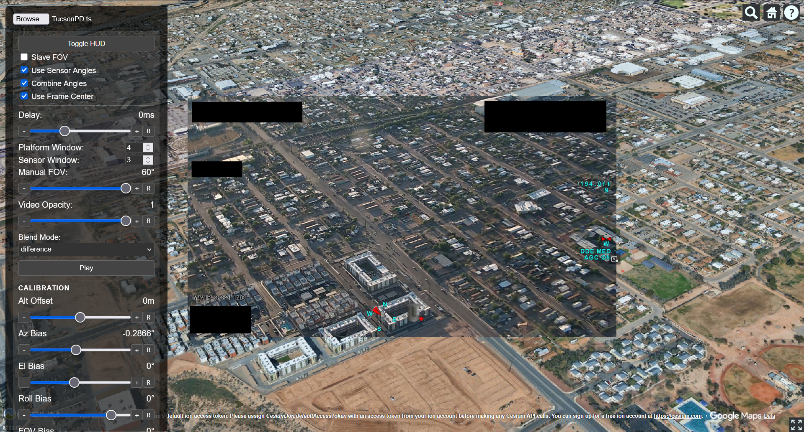

# Cesium KLV Visualizer

A high-performance web application for visualizing geospatial video and KLV (Key-Length-Value) metadata in a 3D environment using CesiumJS. This tool synchronizes MPEG-TS video playback with telemetry data to project the sensor's field of view onto the globe, providing a rich "sensor-eye" visualization experience.



## Features

### 3D Geospatial Visualization
- **CesiumJS Integration:** Renders a high-fidelity 3D globe.
- **Google Photorealistic 3D Tiles:** Utilizes high-resolution 3D tiles for realistic terrain and cityscapes.
- **Dynamic Camera Control:** The 3D camera automatically follows the platform (aircraft/drone) and mimics the sensor's orientation based on KLV data.

### Video & Metadata Player
- **MPEG-TS Support:** Uses `mpegts.js` to play transport streams directly in the browser.
- **KLV Parsing:** Parses MISB ST 0601 metadata embedded in the video stream to extract Platform Position, Attitude, and Sensor Angles. [MISB Standard 0607](https://upload.wikimedia.org/wikipedia/commons/1/19/MISB_Standard_0601.pdf)
- **Time Synchronization:** Syncs video playback time with metadata timestamps (PTS) for accurate correlation.

### Advanced Controls & Calibration
The application includes a comprehensive control panel for fine-tuning the visualization:

#### **Synchronization & Smoothing**
- **Data Delay:** Adjust the time offset between the video and metadata to correct for encoding/decoding latencies.
- **Averaging Windows:** Separate smoothing controls for:
  - **Plat Window:** Averages platform position and attitude (Lat, Lon, Alt, Heading, Pitch, Roll) to reduce jitter.
  - **Sens Window:** Averages sensor gimbal angles (Azimuth, Elevation, Roll) for smoother camera movement.

#### **Sensor Calibration**
Compensate for sensor mounting offsets or data inaccuracies on the fly:
- **Alt Offset:** Adjust the altitude (MSL/HAE) to match the terrain model.
- **Az/El/Roll Bias:** Apply angular offsets to the sensor looking direction.
- **FOV Bias:** Fine-tune the Field of View variable.

#### **Viewing Modes**
- **Slave FOV:** Automatically matches the 3D camera's FOV to the sensor's reported FOV.
- **Manual FOV:** Override the FOV manually if the data is unreliable.
- **Camera Modes:**
  - **Use Frame Center:** Locks the camera to the coordinate the sensor is looking at (Frame Center Lat/Lon).
  - **Use Sensor Angles:** Orients the camera based on Gimbal Azimuth/Elevation/Roll.
  - **Combine Angles:** Combines Platform Heading/Pitch/Roll with Sensor Angles.

#### **Visual Overlays**
- **Video Overlay:** Superimposes the video feed on top of the 3D view.
- **Blend Modes:** Change how the video validates against the 3D background (Screen, Multiply, Overlay, etc.) for easier alignment verification.
- **Opacity:** Adjust transparency of the video overlay.
- **HUD:** Displays real-time telemetry values (Position, Angles, FOV).

## Getting Started

### Prerequisites
- [Node.js](https://nodejs.org/) (v16+ recommended)
- A Cesium Ion Access Token (configured in `main.js` or via environment if applicable, though currently using Google 3D Tiles integration).
- A valid MPEG-TS with MISB 0607 KLV data embedded.

### Installation

1. **Clone the repository:**
   ```bash
   git clone <repository-url>
   cd cesium_klv_js
   ```

2. **Install dependencies:**
   ```bash
   npm install
   ```

### Running Locally

Start the development server:
```bash
npm run dev
```
Open your browser to the URL provided (typically `http://localhost:5173`).

### Usage

1. **Load a File:** Click the "Choose File" button to select a `.ts` (MPEG-TS) file containing KLV metadata.
2. **Play:** The video will start playing, and the 3D camera will jump to the platform's location.
3. **Calibrate:**
   - If the camera is jittery, increase the **Plat Window** or **Sens Window** sizes.
   - If the video overlay doesn't match the 3D terrain, adjust **Alt Offset**, **Az Bias**, or **El Bias**.
   - Use **Data Delay** to align the movement of the video with the movement of the map.

## Project Structure

- **`index.html`**: The main entry point containing the UI layout (Controls, HUD, Video Container).
- **`main.js`**: Core logic for:
  - Initializing Cesium Viewer.
  - Setting up the `mpegts.js` player.
  - Parsing KLV buffers.
  - The `scene.preRender` loop which synchronizes video time to metadata and updates the camera.
  - Handling UI events and calibration logic.
- **`public/misb-browser.js`**: A browser-compatible build of the library used for parsing MISB KLV data.

## Technologies Used

- **[CesiumJS](https://cesium.com/platform/cesiumjs/)**: The core 3D geospatial engine.
- **[Vite](https://vitejs.dev/)**: Fast frontend build tool.
- **[mpegts.js](https://github.com/xqq/mpegts.js)**: Media Source Extensions implementation for playing MPEG-TS in the web.
- **MISB ST 0601**: Standard parsing for UAV metadata.
